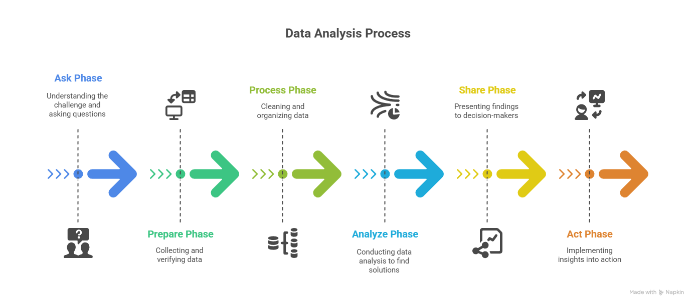

## 📊 The 6-Step Data Analysis Process

This diagram illustrates the typical steps:
1. **Ask**
2. **Prepare**
3. **Process**
4. **Analyse**
5. **Share**
6. **Act**

Each step guides your approach to extracting insights and driving decisions.
